# 2026 EY AI & Data Challenge — Team Playbook

This repository supports the **EY 2026 Optimizing Clean Water Supply Challenge**.

Goal: build AI models that predict three water quality parameters for South African river samples:

- Total Alkalinity
- Electrical Conductance (EC)
- Dissolved Reactive Phosphorus (DRP)

Primary scoring metric: **mean R²** across all three targets.

---

## 1) Repository Assets

### Core datasets

- `water_quality_training_dataset.csv` (training labels + geo/time)
- `submission_template.csv` (200 inference points)

### General notebooks

- `Benchmark_Model_Notebook.ipynb`
- `Landsat_Data_Extraction_Notebook.ipynb`
- `TerraClimate_Data_Extraction_Notebook.ipynb`
- `Landsat_Demonstration_Notebook.ipynb`
- `TerraClimate_Demonstration_Notebook.ipynb`

### Improved modeling notebook

- `Improved_Water_Quality_Model.ipynb`

---

## 2) End-to-End Data Architecture

```plantuml
@startuml
left to right direction
skinparam packageStyle rectangle

rectangle "Target Data\nwater_quality_training_dataset.csv" as A
rectangle "Submission Template\nsubmission_template.csv" as A2

rectangle "Ingestion & Standardization" as B
rectangle "Inference Input Standardization" as B2

rectangle "Core Keys\nlat, lon, sample_date, station_key" as F
rectangle "Core Keys\nlat, lon, sample_date, station_key" as F2

rectangle "Landsat Notebook Outputs\nbands, NDVI, cloud-filtered summaries" as C
rectangle "TerraClimate Notebook Outputs\nppt, tmax, tmin, soil, runoff, etc." as E

rectangle "Feature Store Layer" as D
rectangle "Validation Feature View" as D2

rectangle "Feature Engineering" as G
rectangle "Temporal features\nmonth, dayofyear, cyclic encodings" as G1
rectangle "Spatial features\ndistance/proximity interactions" as G2
rectangle "Lag windows\n1m, 3m, 6m" as G3

rectangle "Training Matrix X_train" as H
rectangle "Target-wise Modeling" as I
rectangle "Alkalinity model" as I1
rectangle "EC model" as I2
rectangle "DRP model" as I3

rectangle "GroupKFold CV by station_key" as J
rectangle "Model Selection & Ensemble" as K
rectangle "Final fit on full train data" as L

rectangle "Build X_submit with same pipeline" as M
rectangle "Predict all 3 targets" as N
rectangle "Post-processing & schema checks" as O
rectangle "Final submission CSV" as P

A --> B
A2 --> B2
B --> F
B2 --> F2
C --> D
E --> D
F --> D
F2 --> D2
D --> G
G --> G1
G --> G2
G --> G3
G1 --> H
G2 --> H
G3 --> H
H --> I
I --> I1
I --> I2
I --> I3
I1 --> J
I2 --> J
I3 --> J
J --> K
K --> L
D2 --> M
L --> N
M --> N
N --> O
O --> P

@enduml
```

---

## 3) Why This Architecture

1. **Generalization-first validation**: GroupKFold by `station_key` reduces location leakage.
2. **Target-specific learning**: alkalinity, EC, and DRP behave differently and should not be forced into one shared configuration.
3. **Feature sufficiency**: geo+date alone is usually not enough, especially for DRP; climate and land-surface signals improve predictive power.
4. **Submission reliability**: one consistent feature pipeline is reused for train and inference to prevent schema drift.

---

## 3.1) Layered Architecture (PlantUML)

```plantuml
@startuml
left to right direction
skinparam packageStyle rectangle

package "Data Layer" {
	rectangle "Training Target Data\nwater_quality_training_dataset.csv" as DL1
	rectangle "Submission Template\nsubmission_template.csv" as DL2
	rectangle "Landsat Raw/Derived Outputs" as DL3
	rectangle "TerraClimate Raw/Derived Outputs" as DL4
}

package "Feature Layer" {
	rectangle "Standardization + Keying\n(lat, lon, sample_date, station_key)" as FL1
	rectangle "Feature Store / Feature Views" as FL2
	rectangle "Feature Engineering\nTemporal + Spatial + Lag Windows" as FL3
}

package "ML Layer" {
	rectangle "Training Matrix (X, y)" as ML1
	rectangle "Target-wise Models\nAlkalinity / EC / DRP" as ML2
	rectangle "GroupKFold by station_key" as ML3
	rectangle "Model Selection + Ensembling" as ML4
	rectangle "Final Fit on Full Train" as ML5
}

package "Delivery Layer" {
	rectangle "Inference Matrix X_submit" as OL1
	rectangle "Batch Prediction (3 targets)" as OL2
	rectangle "Post-processing + QA" as OL3
	rectangle "Submission CSV" as OL4
}

DL1 --> FL1
DL2 --> FL1
DL3 --> FL2
DL4 --> FL2
FL1 --> FL2
FL2 --> FL3
FL3 --> ML1
ML1 --> ML2
ML2 --> ML3
ML3 --> ML4
ML4 --> ML5
FL3 --> OL1
ML5 --> OL2
OL1 --> OL2
OL2 --> OL3
OL3 --> OL4

@enduml
```

---

## 4) Team of 3: Practical Operating Model

Your team mix:

- 1 non-technical teammate
- 2 somewhat technical teammates

### Suggested roles

#### Role A — Model Builder (Technical)

- Owns `Improved_Water_Quality_Model.ipynb`
- Runs CV experiments and tracks mean R²
- Produces final `submission_*.csv`

#### Role B — Data/Features Builder (Technical)

- Owns Landsat/TerraClimate extraction notebooks
- Maintains join keys (`lat`, `lon`, `date`) and lag features
- Delivers clean feature files to Role A

#### Role C — Impact & Story Lead (Non-Technical)

- Owns challenge narrative, social/health impact framing, and final presentation draft
- Tracks assumptions, data source citations, and model decisions in plain language
- Leads business-plan sections for beneficiary impact and policy use cases

### Hand-off contract (simple)

- Role B provides a feature table with one row per training sample and one row per submission sample.
- Role A returns scorecards (per-target R² + mean R² + top features).
- Role C converts scorecards into stakeholder-friendly insights and final pitch language.

---

## 5) Two-Week Execution Plan (Repeatable)

### Cycle 1 (Days 1–4)

- Reproduce benchmark and baseline scores
- Lock validation strategy (GroupKFold by station)
- Establish experiment tracker table

### Cycle 2 (Days 5–8)

- Add TerraClimate features and lag windows
- Run target-wise tuning
- Compare against baseline

### Cycle 3 (Days 9–12)

- Add Landsat-derived features
- Blend best models per target
- Generate stable submission candidate

### Cycle 4 (Days 13–14)

- Final QA (schema, missing values, leakage checks)
- Final submission
- Draft business impact narrative and presentation assets

---

## 6) Minimum Quality Checklist Before Submission

- [ ] Submission file has exact columns and order required by template
- [ ] No null predictions
- [ ] No negative predictions after clipping
- [ ] CV used grouped folds (not random-only split)
- [ ] Model inputs are reproducible and source datasets are public/open
- [ ] Team can explain top 5 drivers in plain language

---

## 7) Current Status Snapshot

- Improved baseline notebook exists and runs end-to-end.
- Grouped CV indicates EC is learnable with current features.
- DRP remains the hardest target and likely needs richer TerraClimate/Landsat features.

---

## 8) Next Immediate Step

Integrate outputs from:

- `TerraClimate_Data_Extraction_Notebook.ipynb`
- `Landsat_Data_Extraction_Notebook.ipynb`

into `Improved_Water_Quality_Model.ipynb`, then rerun grouped CV and generate the next submission candidate.
